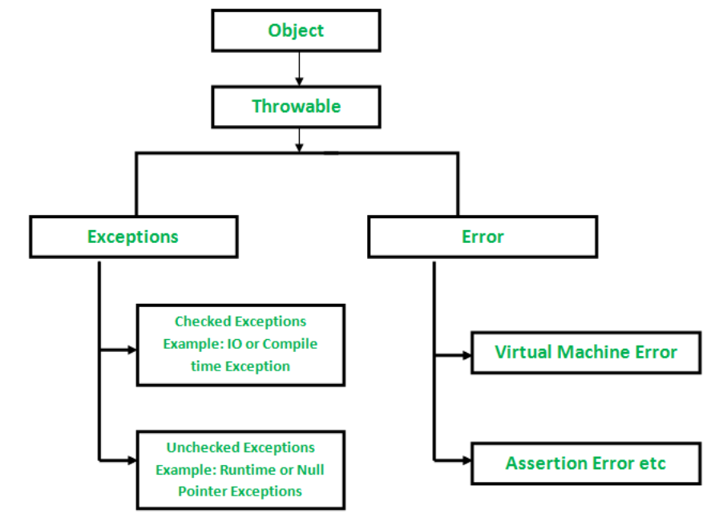

## 1. Checked vs Unchecked Exceptions
   - **Checked Exceptions:**
     - Checked exceptions are subclasses of `Exception` (excluding `RuntimeException` and its subclasses).
     - They must be either caught using a `try-catch` block or declared in the method's `throws` clause.
     - *Example:* `IOException`, `SQLException`.
   
   - **Unchecked Exceptions:**
     - Unchecked exceptions are subclasses of `RuntimeException`.
     - They do not require explicit handling (caught or declared).
     - *Examples:* `NullPointerException`, `ArrayIndexOutOfBoundsException`.

## 2. Purpose of the `finally` Block
   - The `finally` block ensures that certain code is executed, whether an exception occurs or not.
   - Commonly used for cleanup operations (e.g., closing resources like files or database connections).
   - It guarantees the execution of critical code even if an exception is thrown.

## 3. Custom Exceptions in Java
   - Custom exceptions are user-defined exception classes that extend `Exception` or its subclasses.
   - They are useful when the standard Java exceptions do not capture the specific nature of a problem.
   - *Example:*
     ```java
     class CustomException extends Exception {
         CustomException(String message) {
             super(message);
         }
     }
     ```

## 4. `throws` Clause vs `throw` Keyword
   - The `throws` clause is used in method declarations to indicate the exceptions that might be thrown.
   - *Example:* `void myMethod() throws CustomException { }`
   - The `throw` keyword is used to explicitly throw an exception within the code.
   - *Example:* `throw new CustomException("This is a custom exception");`

## 5. `try-with-resources` Statement
   - `try-with-resources` simplifies resource management by automatically closing resources (like `AutoCloseable` objects) after the try block.
   - *Example:*
     ```java
     try (BufferedReader br = new BufferedReader(new FileReader("file.txt"))) {
         // Code to read from the file
     } catch (IOException e) {
         // Handle the exception
     }
     ```

## 6. `Error` Class vs `Exception` Class
   - `Error` is used to represent serious, unrecoverable errors that are typically system-related.
   - *Example:* `OutOfMemoryError`, `StackOverflowError`.
   - `Exception` is used for less severe, recoverable issues that the program might encounter during execution.

## 7. `getCause()` Method
   - The `getCause()` method in the `Throwable` class returns the cause of the exception or `null` if the cause is nonexistent or unknown.
   - Useful for diagnosing the root cause of an exception when exceptions are chained.
   - *Example:*
     ```java
     try {
         // Some code that may throw an exception
     } catch (Exception e) {
         Throwable cause = e.getCause();
         // Further analysis or handling based on the cause
     }
     ```

## 8. Multiple Catch Blocks
   - Multiple catch blocks allow handling different types of exceptions in separate blocks.
   - They are processed in order, and the first matching block is executed.
   - *Example:*
     ```java
     try {
         // Code that may throw either NullPointerException or ArrayIndexOutOfBoundsException
     } catch (NullPointerException e) {
         // Handle NullPointerException
     } catch (ArrayIndexOutOfBoundsException e) {
         // Handle ArrayIndexOutOfBoundsException
     }
     ```

## 9. Exception Chaining
   - Exception chaining involves throwing a new exception while capturing the original exception as the cause.
   - Useful for preserving information about the root cause of an exception.
   - *Example:*
     ```java
     try {
         // Code that may throw an exception
     } catch (Exception originalException) {
         throw new CustomException("A custom exception occurred", originalException);
     }
     ```

## 10. Best Practices for Exception Handling
   - Be specific in exception catching; avoid catching generic `Exception` unless necessary.
   - Document exceptions thrown by methods using the `throws` clause.
   - Use custom exceptions for application-specific errors.
   - Keep exception handling code concise and focused on error recovery.
   - Log exceptions with relevant information for debugging.



# Custom Exception Handling in Java

Custom exception handling in Java allows you to define your own exception classes to handle specific error conditions in your application. Here's a step-by-step guide on how to create and use custom exceptions:

1. **Create a Custom Exception Class**: You need to create a new class that extends either `Exception` or one of its subclasses, depending on whether you want your exception to be checked or unchecked.

    ```java
    public class CustomException extends Exception {
        public CustomException(String message) {
            super(message);
        }
    }
    ```

    Or for unchecked exceptions:

    ```java
    public class CustomRuntimeException extends RuntimeException {
        public CustomRuntimeException(String message) {
            super(message);
        }
    }
    ```

2. **Throwing the Custom Exception**: In your code, when a specific error condition occurs, you can throw your custom exception.

    ```java
    public class MyClass {
        public void someMethod() throws CustomException {
            // Some condition that triggers the exception
            throw new CustomException("This is a custom exception message.");
        }
    }
    ```

3. **Handling the Custom Exception**: When calling methods that can throw your custom exception, you need to handle it appropriately. You can catch it like any other exception.

    ```java
    public class Main {
        public static void main(String[] args) {
            try {
                MyClass myObject = new MyClass();
                myObject.someMethod();
            } catch (CustomException e) {
                System.out.println("Custom exception caught: " + e.getMessage());
                // Handle the exception or rethrow it
            }
        }
    }
    ```

4. **Optional: Rethrowing or Wrapping**: Depending on your application's requirements, you may choose to handle the exception within the catch block, rethrow it, or wrap it in another exception.

    ```java
    // Rethrow the same exception
    catch (CustomException e) {
        System.out.println("Custom exception caught: " + e.getMessage());
        throw e;
    }

    // Wrap the exception in another exception
    catch (CustomException e) {
        System.out.println("Custom exception caught: " + e.getMessage());
        throw new AnotherException("An error occurred", e);
    }
    ```

Custom exceptions allow you to create more meaningful and specific error handling mechanisms in your Java applications. They are particularly useful when you need to distinguish between different error conditions and provide customized error messages or handling logic for each situation.
